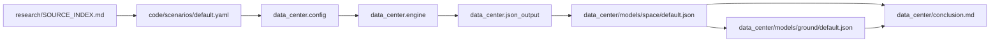

# Architecture Intent

This repository is the agent-first research and modeling system for Rocket Lab
Research. The repository-level umbrella covers Rocket Lab-focused research,
communications, and future rocket-related investigations. Two applications are
modeled: the orbital AI-inference data-center workstream (the first public
release) and the communications workstream, whose first model family is the
Iridium model (the maximum practical performance of Iridium's owned L-band on a
Neutron-launched fleet; see communications/design.md for the model-family
structure).

## System Shape

The system has four public layers:

| Layer | Public location | Responsibility |
|---|---|---|
| Research | `research/` | Evidence, source notes, synthesis, claim ledger, and open questions. |
| Scenario inputs | `code/scenarios/` | Machine-readable model assumptions. |
| Model code | `code/src/data_center/` | Typed config parsing, model execution, JSON assembly, promotion, and tests. |
| Public artifacts | `data_center/` | Static conclusion, assumption ledger, and promoted JSON. |

Human docs are reviewed reading paths. JSON artifacts are the canonical
machine-readable model outputs.

## Public Artifact Flow



`data_center/conclusion.md` is connected to the promoted defaults by review,
not by automatic file generation. Promotion refreshes JSON only.

## Default Scenario Flow

`code/scenarios/default.yaml` is the public machine-readable default scenario.
It is loaded through Pydantic config models in `data_center.config`, then passed
to `data_center.engine.run_valuation`. The engine builds the year-by-year
physical and business outputs from explicit typed inputs. Code-level defaults
may exist for developer ergonomics, but they are not a second public contract.

If the default scenario changes, review these together:

- `code/scenarios/default.yaml`
- `data_center/models/space/default.json`
- `data_center/models/ground/default.json`
- `data_center/assumptions.md`
- `data_center/conclusion.md`
- `research/SOURCE_INDEX.md` when source claims changed

## Promotion Flow

`uv run rklb-value --promote` writes:

```text
data_center/models/space/default.json
data_center/models/ground/default.json
```

Named promotions write named space JSON under `data_center/models/space/`.
Promotion does not write `data_center/conclusion.md`. That invariant prevents a
new timestamped model run from silently replacing reviewed prose.

## Space Model Modules

| Module | Role |
|---|---|
| `config.py` | Pydantic scenario config and schema boundary. |
| `generations.py` | GPU package generation specs and extrapolation. |
| `cadence.py` | Launch-cadence curve and integer launch output. |
| `fleet.py` | Deployed-year cohorts and living-fleet rollup. |
| `volume.py` | Stowed volume reporting and validation support. |
| `engine.py` | Main model orchestration from config to typed output. |
| `input_manifest.py` | Agent-readable input tree and assumption index. |
| `provenance.py` | Provenance cells and formula catalog. |
| `output.py` | Public Pydantic output models. |
| `json_output.py` | JSON assembly, data dictionary, validation metadata, and rendering. |
| `query_examples.py` | Embedded `jq` examples for cold-reader interrogation. |
| `cli.py` | Command-line interface and promotion. |

The deep modules are the config boundary, engine, input manifest, output
contract, and ground reference. Callers should not recreate their internal
logic.

## Ground Model Modules

`data_center.ground` owns the ground reference model. It takes the promoted
space model's 2036 deployed-year cohort as the anchor, then compares five-year
ground cost against the orbital build-and-launch reference for the same GPU
package cohort. Its current conclusion label is `same_order_of_magnitude`
because the ground-side inputs now trace to per-input research-wiki source
statuses.

The ground model must not anchor to market share or living-fleet capacity. The
anchor is the deployed-year cohort.

## Source Catalog And Input Manifest

Release-critical assumptions are source-status labeled through
`research/SOURCE_INDEX.md` and the `RLDC-*` claim IDs. The promoted space JSON
duplicates that trail into `inputs.assumption_index`, where each assumption cell
has a path, value, unit, source status, source references, rationale, and notes.

Public hard numbers in docs should cite either a JSON path or a source ID. If a
number cannot be traced, it should not appear as a public claim.

## Static Docs Versus Dynamic Models

Static docs:

- `README.md`
- `data_center/README.md`
- `data_center/assumptions.md`
- `data_center/conclusion.md`
- `docs/architecture-intent.md`
- `docs/adr/*.md`
- `docs/agent-guide.md`

Dynamic model artifacts:

- `data_center/models/space/default.json`
- `data_center/models/ground/default.json`
- scratch JSON under `code/outputs/data_center/runs/`

Static docs change only through intentional edits. Dynamic JSON changes through
model runs and promotion.

## Invariants

- Promoted JSON is canonical for agent interrogation.
- Static docs are not rewritten by promotion.
- Inputs and outputs are typed and explicit.
- Known-shape public data uses Pydantic models, not loose dictionaries.
- Every release-critical input has source status and rationale.
- Public launch and node counts are whole counts.
- Deployed-year cohort and living fleet remain separate concepts.
- Ground comparison anchors to the 2036 deployed-year cohort.
- The ground reference is a source-backed order-of-magnitude screen, not a
  parity claim.
- Communications is a modeled workstream: model families by communication
  paradigm (the Iridium model first, the High-Bandwidth Cellular Pure Play
  model second), sharing the common cadence spine, never importing data_center
  (the cross-import guard enforces it), with the DC promotion pattern
  (scenario, promoted JSON, static conclusion) mirrored under communications/.
- The old flat public model alias is not restored.

## Current Open Concerns

- Ground reference refinements may still adjust facility, energy, cooling,
  operations, utilization, and GPU/package-cost assumptions, but the current
  promoted ground reference is source-linked through the research wiki.
- Launch cost, payload upgrade, solar cost, radiator cost, and GPU generation
  extrapolation remain the load-bearing data-center uncertainties.
- The static conclusion must be re-reviewed whenever the default scenario or
  promoted JSON changes.
- The communications ARPU revenue case is deferred until per-tier prices are
  set; operations cost is an explicit zero assumption pending research; the
  Iridium-model ecosystem assumption (in-chipset band support for the phone
  tier) is the stated load-bearing conditional.

## Test Coverage Expectations

The code suite should keep covering:

- config parsing and input schema behavior,
- generation and physical-model calculations,
- launch cadence and integer mission outputs,
- deployed-year versus living-fleet capacity,
- source-status and input-manifest contract,
- JSON schema and query examples,
- promotion paths and static-conclusion stability,
- ground reference anchoring and parity-boundary warnings,
- ruff, ruff format, mypy strict, and pytest.
